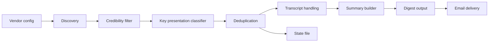

# AI Vendor Presentation Monitor

An automated Python pipeline that monitors official AI vendor presentation sources, filters for credible/key presentations, deduplicates repeated links, and prepares a daily digest.

This public repository is a sanitized portfolio version. It contains no secrets, no personal digest history, and no production schedule.

## What It Shows

- Config-driven source monitoring for AI vendors.
- Official-source filtering for vendor domains and allowlisted YouTube channels.
- Key-presentation classification for keynotes, launches, demos, webinars, and conference talks.
- Duplicate detection using platform IDs, canonical URLs, and fuzzy title matching.
- Transcript safety boundary: links YouTube videos but does not rip/download YouTube media.
- Optional legal-media transcription using Groq or Deepgram when a direct vendor-owned media file exists.
- Optional summarization with OpenAI when transcripts are available.
- Gmail digest delivery in the private production setup.
- Tests and GitHub Actions CI.

## Architecture



## Source Policy

The monitor is intentionally conservative:

- Accepts official vendor domains.
- Accepts allowlisted official YouTube channels.
- Rejects reposts, reaction videos, fan mirrors, stock-analysis commentary, and unverified sources.
- Does not rip YouTube audio/video.
- Transcribes only when a legal direct vendor-owned media file is available.

## Vendors In The Sample Config

- OpenAI
- Anthropic / Claude
- DeepSeek
- Qwen / Alibaba Cloud
- Kimi / Moonshot AI
- MiniMax / Hailuo AI
- n8n
- LangChain
- Palantir
- Salesforce

## Local Setup

```bash
python -m venv .venv
source .venv/bin/activate
pip install -r requirements.txt
cp .env.example .env
```

On Windows PowerShell:

```powershell
python -m venv .venv
.\.venv\Scripts\Activate.ps1
pip install -r requirements.txt
Copy-Item .env.example .env
```

Add API keys to `.env` only for local testing. Never commit `.env`.

## Run

Dry run, no email and no state writing:

```bash
python pipeline.py --dry-run --max-items 10
```

Write local digest/state but skip Gmail:

```bash
python pipeline.py --no-email --max-items 10
```

Run tests:

```bash
pytest -q
```

## GitHub Actions

This showcase repository includes a safe CI workflow at:

```text
.github/workflows/tests.yml
```

The private production version uses a daily workflow with repository secrets for YouTube and Gmail. A non-running example is included at:

```text
examples/daily-digest.workflow.example.yml
```

## Example Output

See:

```text
examples/sample-digest.md
examples/sample-items.jsonl
```

## Privacy And Safety

This public version intentionally excludes:

- Gmail address
- Gmail app password
- API keys
- Production digest history
- Transcripts
- Private repository secrets

## Future Improvements

- Add source-specific connectors for more official event hubs.
- Add a small dashboard for browsing saved presentations.
- Add Slack/Telegram digest delivery.
- Improve transcript capture when vendors publish official caption/transcript files.
- Add stronger speaker extraction and title normalization.
